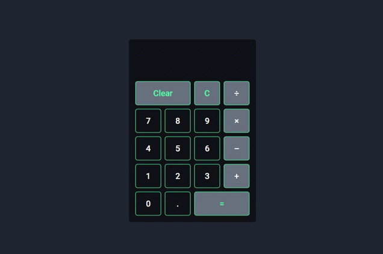

# Projeto da mentoria 5ª Semana (Calculadora em React)

 Projeto destinado a criação de uma calculadora com a tecnologia React. Atividade de Mentoria.

 
 
 :fire: Proposta do projeto :nerd_face:

 
 
  

O que acha de acessar o projeto? 
 <a href="https://oscarlojr.github.io/calculadora_react/" target="_blank">Tela Inicial</a>
